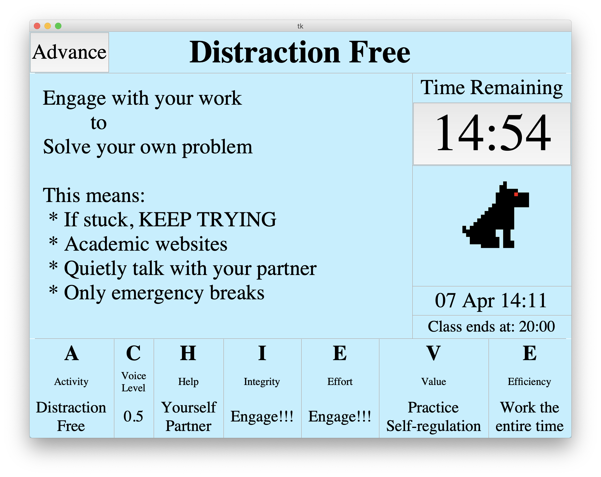

# RotationTracker
Python application to rotate through different classroom activities.

In an effort to model a self-paced structure I have devised the following rotation.

  * 15 minutes of Distraction Free time
  * 5 minutes of Question/Discussion time
  * 10 minutes of Flex Time

  
## Distraction Free
Students must be working on academic work and I (the teacher) will NOT answer questions.
The goal is to have students try and work through problems on their own building resiliance and all of the self-(insert word here) things.
The teachers only job during this period is to keep the students on task and keep the room quite.

## Question/Discussion
Students ask the questions they came up with during the distraction free time.
The idea is that the students should be able to answer and discuss the answers themselves without my input.
However if needed I'll answer or direct the conversation as needed.

## Flex Time
This is the time students have to themselves, they can watch videos, listen to music, socialize with others.
Students must respect those that are trying to continue working by not distracting them.
The teachers job is to answer any other questions and check in with the students.

# Usage Notes
Each 'slide' of the rotation timer has its own text file with all of the information that is loaded to that slide.

Currently the order is fixed, but will probably be made flexible in the future.

Additionally, there is music that plays when the rotation changes, but due to copyright laws,
no music was synced to this repository.

Playing music requires (at the moment) that the user have VLC installed because it relies on VLC to play the media because I have yet to find an easy python module that will do the job.
